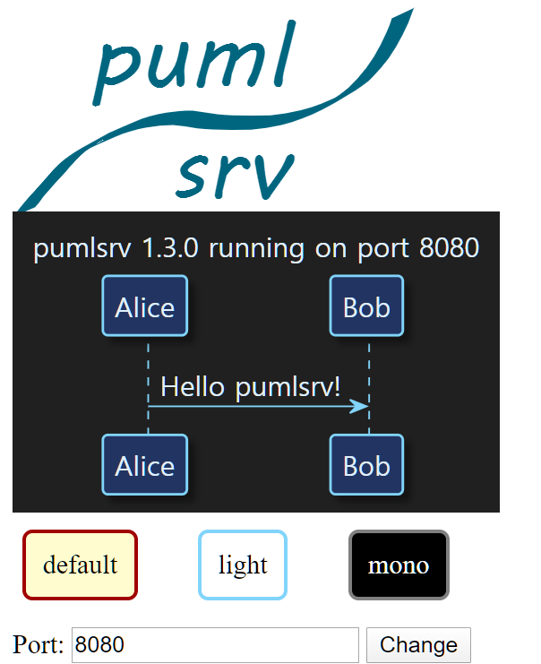

# pumlsrv
Small and efficient PlantUML HTTP Server

# Abstract

This is a small (fast) replacement of [Plant-UML Server](https://github.com/plantuml/plantuml-server) which can run without installing any other http servers.

Ease of use: the main settings can be configured on the main page and will be saved and restored on next startup.

Up to date: the newest plantuml*.jar is automatically downloaded. The download is saved to the current directory of pumlsrv.jar. The updates can be switched off or done manually - just copy a valid plantuml*.jar file to the same directory - zip files have to be unpacked first. 



## Installation

`get.sh` downloads the release jar to `~/.local/share/pumlsrv` and creates a `pumlsrv` launcher in `~/.local/bin`. The download is verified against the sha256 digest that GitHub records for the release asset; the install fails on any mismatch.

It also installs the `pumlcli` command-line client into `~/.local/bin` and downloads the latest `plantuml-*.jar` next to the `pumlsrv` jar, so the server has a renderer available on first start. Both are best-effort: if either download fails the install still completes (pumlsrv can fetch the PlantUML jar itself on first start unless updates are disabled).

```
curl -sSL https://raw.githubusercontent.com/michael72/pumlsrv/master/get.sh | bash
```

For scripted or reproducible installs, pin the version — and preferably also fetch the script itself from a tag or commit instead of `master`, so the executed code cannot change underneath you (available from tags newer than v2.1.1):

```
curl -sSL https://raw.githubusercontent.com/michael72/pumlsrv/<tag-or-commit>/get.sh \
  | PUMLSRV_VERSION=<tag> PUMLSRV_SHA256=<expected-jar-sha256> bash
```

Supported overrides:

- first argument or `PUMLSRV_VERSION` — release tag to install (default: latest)
- `PUMLSRV_SHA256` — expected sha256 of the jar; overrides the digest reported by the GitHub API
- `PUMLSRV_START` — `n` to never start the server after installing, `y` to always start; when unset, the script prompts on a terminal and does not start otherwise (e.g. when piped into `bash`)

## Usage

This http server runs on localhost on with the given port - default port is 8080. When using `h` parameter the options are shown: 

```
java -jar pumlsrv*.jar -h

Usage: pumlsrv [-cDhjLMnNruV] [--debug=<debugdir>] [-i=<include_file>] [PORT]
An efficient and small implementation of a PlantUML server.
      [PORT]           Port of the http server to connect to
  -c, --clear          Clear default settings (except used port)
  -D, --dark           Switch to dark mode
      --debug=<debugdir>
                       Directory to write debug files (incoming .puml and
                         rendered output) for each /plantuml/... request
  -h, --help           Show this help message and exit.
  -i, --include=<include_file>
                       Additional style to include for each UML
  -j, --nodynamicjar   Do not try to load the plantuml.jar dynamically.
  -L, --light          Switch to light mode
  -M, --monochrome     Switch to monochrome mode
  -n, --nosettings     Do not use and store current settings. By default the
                         last settings are saved and used on next startup
                         (without parameters).
  -N, --nobrowser      Do not show browser on startup. By default the browser
                         is opened on the current root page.
  -r, --reload         Reload the include file on every access
  -u, --noupdates      Do not check for updates of plantuml.jar and pumlsrv.
  -V, --version        Print version information and exit.
```

The main page that pops up (except when using `-N`) can be used to configure the settings. The settings configured here are automatically saved and restored on next startup.

### Debug Mode

The `--debug <debugdir>` option enables request/response logging for all `/plantuml/...` rendering requests. For each such request pumlsrv writes two files into `<debugdir>` (created automatically if it does not exist):

- `<yyyyMMdd-HHmmss>.puml` — the incoming PlantUML source
- `<yyyyMMdd-HHmmss>.<format>` — the rendered output (e.g. `.svg`, `.png`, …)

Example:

```
java -jar pumlsrv*.jar --debug /tmp/puml-debug
```

Also the environment variable `PUMLSRV_PORT`is checked and used when no parameter is given to configure the port.

### Command line client

The `pumlcli` bash script renders PlantUML source through a running pumlsrv instance (`http://localhost:${PUMLSRV_PORT:-8080}`). It reads the diagram from a file (`-f`) or STDIN, and writes the result to a file (`-o`) or STDOUT. The output type (`txt`, `svg` or `png`) is taken from `-t` first, then from the extension of `-o`, and defaults to `txt`:

```
pumlcli -f diagram.puml -o diagram.svg
cat diagram.puml | pumlcli -t png > diagram.png
echo '@startuml
Bob -> Alice : hello
@enduml' | pumlcli
```

The only dependencies are standard Unix tools (`gzip`, `base64`, `curl`).

The environment variables `HTTP_PROXY` and `HTTPS_PROXY` are checked when downloading updates behind a proxy.

Editors that can connect to the official PlantUML server - such as jebbs excellent PlantUML plugin running in Visual Studio Code or CodiMD- can simply connect to pumlsrv via http protocol.

Like the official Plant-UML server pumlsrv also supports the output types png, svg, eps, epstext and txt.

### Markdown diagram tooling

The `tools/` folder contains a few Python helpers for working with PlantUML
diagrams embedded in Markdown files. They all drive diagrams through `pumlcli`,
so a pumlsrv instance has to be running. The extracted diagram files follow the
naming schema `<markdown_name>_<index>[_<diagram_name>].<suffix>`, where `index`
counts `00`, `01`, `02`, … in document order and `diagram_name` is taken (in
snake_case) from the `@startuml <name>` directive when present.

- `extract_puml.py <markdown-file> [<diagrams-folder>] [-t svg|png|txt]` —
  extracts every ` ```plantuml ` / ` ```puml ` block into its own `.puml` file
  in the diagrams folder (default `diagrams`, resolved next to the Markdown
  file), renders it via `pumlcli` (default `svg`) and replaces the block with a
  reference to the rendered output. Diagram files that are already referenced
  from the Markdown are re-indexed in document order, renaming their `.puml`
  source and every rendered output to match the schema.
- `convert_rendered.py <markdown-file> [-t svg|png|txt]` — converts all diagram
  references to another output type (default `svg`). References already in the
  target format are skipped; references without a matching `.puml` source are
  warned about and skipped; otherwise the `.puml` source is re-rendered and the
  reference updated.
- `refresh_all.py <markdown-file>` — re-renders every referenced diagram from
  its `.puml` source in the current output type, without changing the Markdown.
- `integrate_puml.py <markdown-file> [-k|--keep]` — the inverse of
  `extract_puml.py`: for every diagram reference with a matching `.puml` source
  next to it, the image reference is replaced by an inline ` ```plantuml ` block
  containing that source. References without a matching `.puml` source are
  warned about and left untouched. By default the inlined diagram files (the
  `.puml` source and its rendered outputs) are removed; pass `-k`/`--keep` to
  retain them on disk.

`md_to_pdf.py` converts a Markdown file (or a whole directory) to PDF or
self-contained HTML with GitHub styling, inlining local images (including the
rendered diagrams) as base64 data URIs.

Enjoy!
