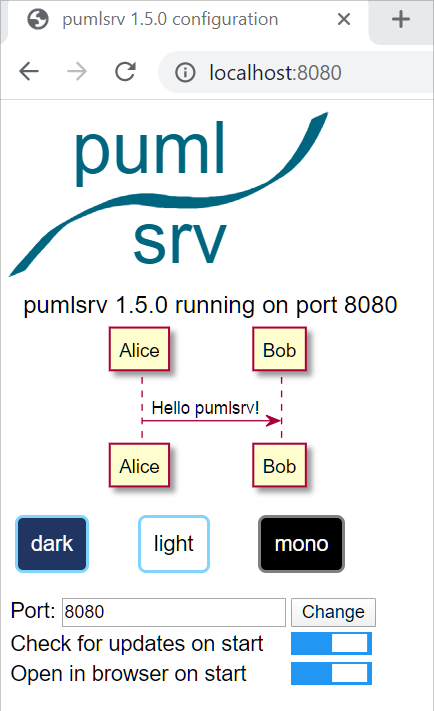

# pumlsrv
Small and efficient PlantUML HTTP Server

# Abstract

This is a small (fast) replacement of [Plant-UML Server](https://github.com/plantuml/plantuml-server) which can run without installing any other http servers.

Ease of use: the main settings can be configured on the main page and will be saved and restored on next startup.

Up to date: the newest plantuml*.jar is automatically downloaded. The download is saved to the current directory of pumlsrv.jar. The updates can be switched off or done manually - just copy a valid plantuml*.jar file to the same directory - zip files have to be unpacked first. 



## Usage

This http server runs on localhost on with the given port - default port is 8080. When using `h` parameter the options are shown: 

```
java -jar pumlsrv*.jar -h

Usage: pumlsrv [-cDhjLMnNruV] [-i=<include_file>] [PORT]
An efficient and small implementation of a PlantUML server.
      [PORT]           Port of the http server to connect to
  -c, --clear          Clear default settings (except used port)
  -D, --dark           Switch to dark mode
  -h, --help           Show this help message and exit.
  -i, --include=<include_file>
                       Additional style to include for each UML
  -j, --nodynamicjar   Do not try to load the plantuml.jar dynamically.
  -L, --light          Switch to light mode
  -M, --monochrome     Switch to monochrome mode
  -n, --nosettings     Do not use and store current settings. By default the
                         last settings are saved and used on next startup
                         (without parameters).
  -N, --nobrowser      Do not show browser on startup. By default the browser
                         is opened on the current root page.
  -r, --reload         Reload the include file on every access
  -u, --noupdates      Do not check for updates of plantuml.jar and pumlsrv.
  -V, --version        Print version information and exit.
```

The main page that pops up (except when using `-N`) can be used to configure the settings. The settings configure here are automatically saved and restored on next startup.

Also the environment variable `PUMLSRV_PORT`is checked and used when no parameter is given to configure the port.

The environment variables `HTTP_PROXY` and `HTTPS_PROXY` are checked when downloading updates behind a proxy.

Editors that can connect to the official PlantUML server - such as jebbs excellent PlantUML plugin running in Visual Studio Code or CodiMD- can simply connect to pumlsrv via http protocol.

Like the official Plant-UML server pumlsrv also supports the output types png, svg, eps, epstext and txt.

Enjoy!
